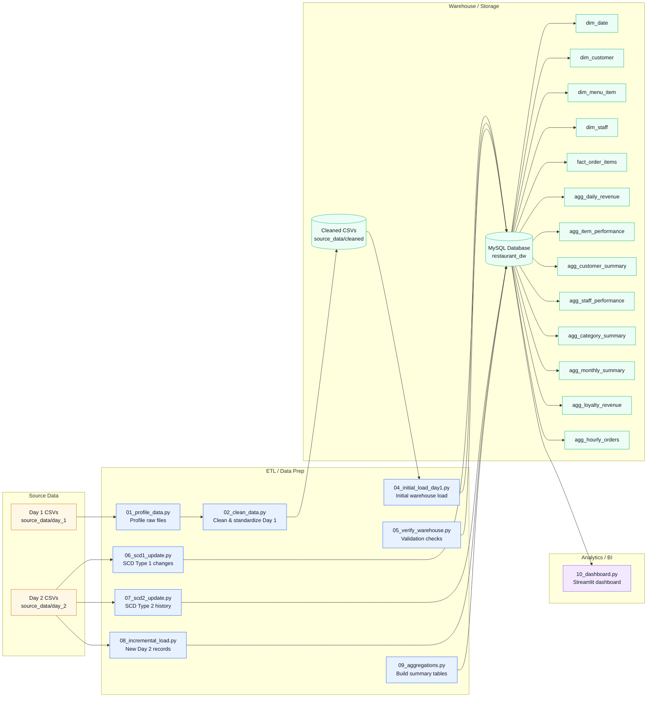

# Project Architecture

## Overview

- Raw Day 1 data is profiled and cleaned first.
- Cleaned Day 1 data is loaded into the MySQL warehouse.
- Day 2 data drives SCD1 updates, SCD2 history changes, and incremental inserts.
- Aggregation tables are built for fast dashboard queries.
- The Streamlit dashboard reads the warehouse and summary tables directly.

## Main Components

- `source_data/day_1`: raw source files for the first load.
- `source_data/day_2`: changed and new records for updates and incremental loading.
- `restaurant_dw`: MySQL warehouse containing dimensions, fact table, control table, and aggregates.
- `10_dashboard.py`: interactive Streamlit analytics layer.
